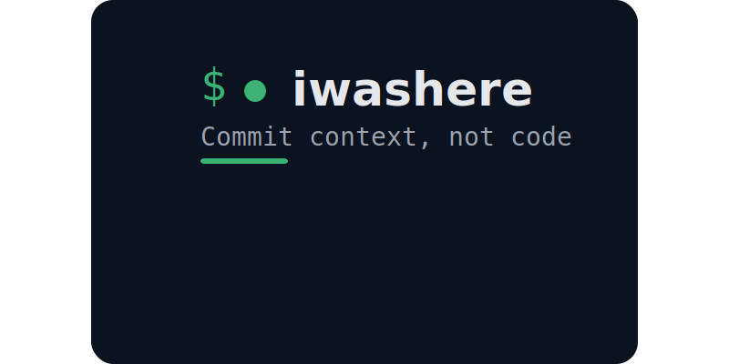

# iwashere


A CLI tool that remembers where you left off in your coding projects.

[](https://github.com/Murchoid/iwashere/releases)
[](https://golang.org)
[](LICENSE)

## Overview

iwashere helps you preserve context across coding sessions. When you step away from a project and come back later, you don't have to spend time figuring out where you left off. Just run iwashere and see your last note, active session, and modified files.

## Features

- **Context Tracking** - Save notes about what you're working on
- **Git Integration** - Automatically captures branch and commit context
- **Sessions** - Group related notes into work sessions
- **Tags** - Organize notes with tags
- **Branch Awareness** - See notes specific to your current branch
- **Status Overview** - Quick summary of where you left off
- **Team Sharing** - Share notes with teammates (encrypted)

### Build from Source

```bash
git clone https://github.com/Murchoid/iwashere.git
cd iwashere
go build -o iwashere ./cmd/iwashere
sudo mv iwashere /usr/local/bin/
```

## Quick Start

```bash
# Initialize iwashere in your project
cd /path/to/your/project
iwashere init

# Add a note about what you're working on
iwashere add "Implementing user authentication, next work on JWT validation"

# Later, see where you left off
iwashere status

# View all your notes
iwashere list

# Start a session to group related work
iwashere session start "Authentication feature"
iwashere add "Set up Passport.js"
iwashere add "Configure JWT strategy"
iwashere session end
```

## Usage

### Core Commands

| Command | Description |
|---------|-------------|
| `iwashere init` | Initialize iwashere in current directory |
| `iwashere add <message>` | Add a new note |
| `iwashere show <id>` | Show a specific note |
| `iwashere list` | List all notes |
| `iwashere edit <id>` | Edit a note |
| `iwashere delete <id>` | Delete a note |

### Organization

| Command | Description |
|---------|-------------|
| `iwashere tag add <id> <tag>` | Add a tag to a note |
| `iwashere tag remove <id> <tag>` | Remove a tag from a note |
| `iwashere tag list [tag]` | List notes by tag |
| `iwashere branch [name]` | Show notes for current or specified branch |

### Sessions

| Command | Description |
|---------|-------------|
| `iwashere session start <name>` | Start a new work session |
| `iwashere session end` | End current session |
| `iwashere session list` | List all sessions |
| `iwashere session show <id>` | Show session details |

### Context & Status

| Command | Description |
|---------|-------------|
| `iwashere status` | Show current context (active session, last note, modified files) |
| `iwashere config` | View or set configuration |

### Sharing

| Command | Description |
|---------|-------------|
| `iwashere share <id> --with <email>` | Share a note with a teammate |
| `iwashere share --with @team` | Share with a team (requires team.json) |
| `iwashere show-shared` | View notes shared with you |

## Configuration

iwashere stores configuration in `.iwashere/config.json`:

```json
{
    "project": {
        "name": "myproject",
        "init_date": "2024-03-03T10:30:00Z"
    },
    "storage": {
        "type": "json",
        "path": "./private"
    },
    "git": {
        "auto_context": true,
        "track_branches": true
    },
    "team": {
        "team_name": "backend-team"
    }
}
```

## Project Structure

When you run `iwashere init`, the following structure is created:

```
your-project/
├── .iwashere/              # Hidden directory (like .git)
│   ├── private/            # Your personal notes (gitignored)
│   └── config.json         # Project configuration
├── .iwashere-shared/       # Encrypted shared notes (can be tracked)
└── .gitignore              # Automatically updated to hide iwashere folders
```

## Development

### Prerequisites

- Go 1.21 or later
- Git

### Building

```bash
# Clone the repository
git clone https://github.com/Murchoid/iwashere.git
cd iwashere

# Build for your current platform
go build -o iwashere ./cmd/iwashere

#or use the build script

# Cross-compile for all platforms
./build.sh
```

### Release Process

1. Update version in code
2. Create and push a tag:

```bash
git tag -a v0.3.1 -m "Release v0.2.0"
git push origin main
```

3. Release with goreleaser
```bash
    goreleaser release --clean
```

## Contributing

Contributions are welcome! Please feel free to submit a Pull Request.

1. Fork the repository
2. Create your feature branch (`git checkout -b feature/amazing-feature`)
3. Commit your changes (`git commit -m 'Add amazing feature'`)
4. Push to the branch (`git push origin feature/amazing-feature`)
5. Open a Pull Request

## License

MIT License - see [LICENSE](LICENSE) file for details.

## Acknowledgments

- Built with Go
- Inspired by the need to remember context across coding sessions

## Support

- [GitHub Issues](https://github.com/Murchoid/iwashere/issues)
- [Discussions](https://github.com/Murchoid/iwashere/discussions)